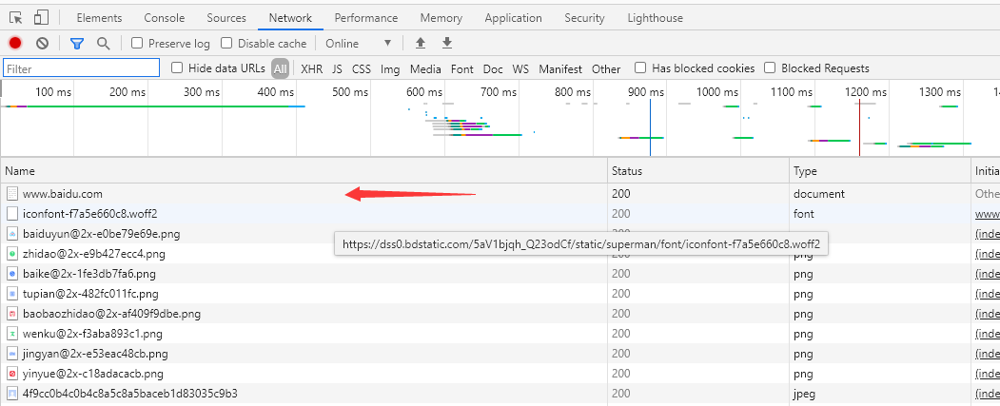

# 教你如何在10秒钟完成一个爬虫

## 背景

1. 在平时浏览网页时，看到一些网站想要他们的数据时，即使抓到网站的HTTP数据包，需要自己去写代码。
2. 写爬虫代码经常会耗费我们的时间，有没有工具让我们在短时间内就可以写好爬虫呢？
3. 平时在web开发时，需要调试一些ajax请求到postman等工具上，是否很不方便？

## 如何来解决这些问题呢？

1. curl转成python的requests

    例如我们在谷歌浏览器查看百度
    
    
    
    可以按F12打开控制台
    
    
    
    将百度的请求转化为curl
    
    
    
    将curl转化为python的requests代码
    
    
    
    至此，python爬虫的代码就写好了。
    
    > curl转python代码的网址
    
    https://curl.trillworks.com/
    
    支持多种语言
    
## 未完待续，还有更多快速实现爬虫的方法与工具